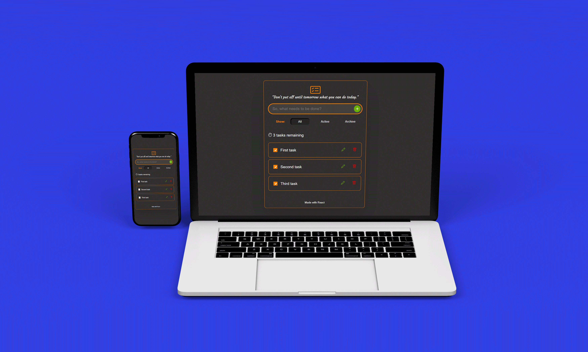
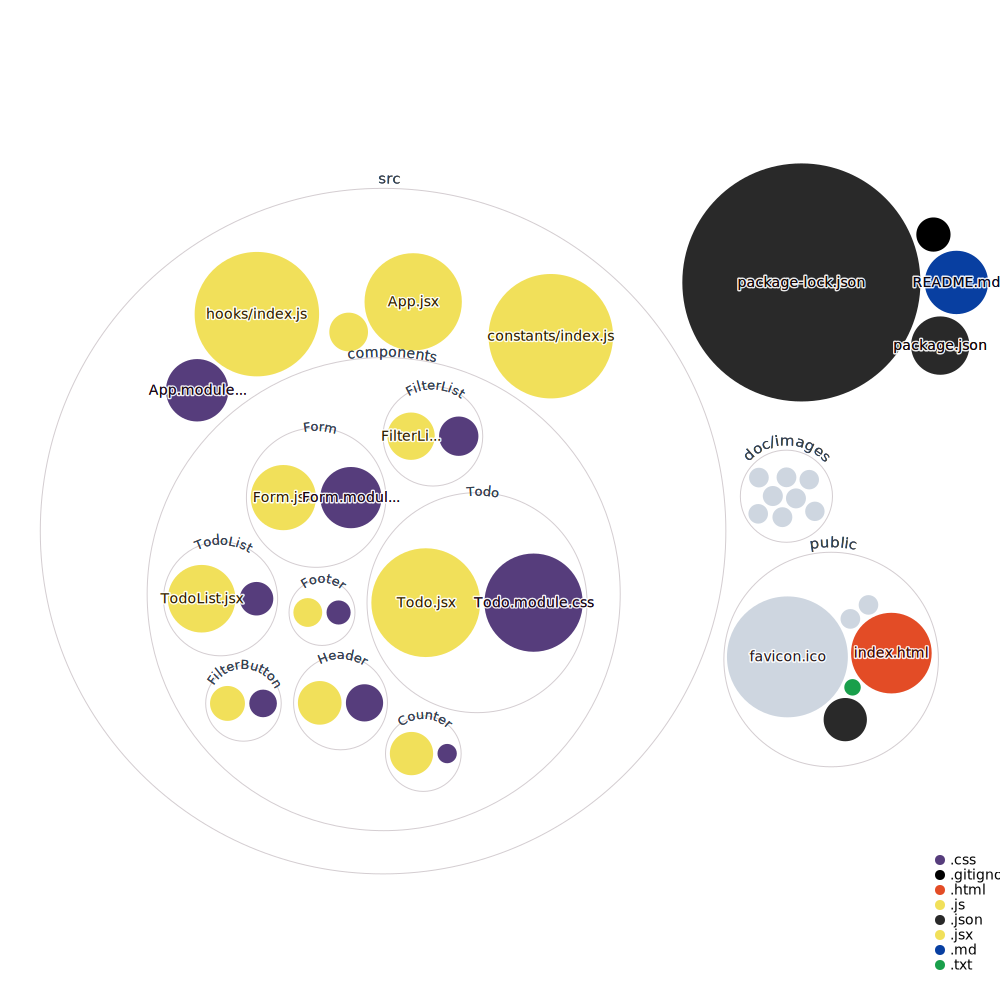

<h1 align="center"> Yet Another Superb Todo App </h1>

## 📄 About Yasta

Yasta is a simple task manager (a fancy word for a todo app) whose sole purpose is to help you organize your tasks. I made Yasta just to learn and try the various awesome packages in the React ecosystem. I really enjoyed creating this app and hope you enjoy using it too.

👉[Try Yasta](https://ya-todo.netlify.app/)

## 🔮 Technologies

Besides love ♥, Yasta was made using these wonderful packages:

&nbsp;

&nbsp;

## 🏛 Architecture

